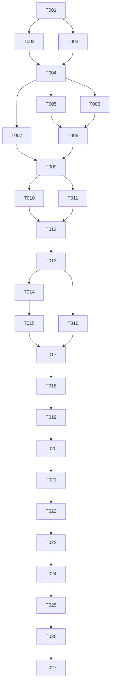

# Tasks: Add Feed Subscriptions

**Input**: Design documents from `specs/001-add-subscriptions/`.

**Prerequisites**: [plan.md](plan.md), [spec.md](spec.md), [research.md](research.md),
[data-model.md](data-model.md), [contracts/subscriptions.md](contracts/subscriptions.md),
[quickstart.md](quickstart.md), and [constitution](../../.specify/memory/constitution.md).

**Tests**: No TDD or automated test framework was requested. The specification and constitution
require manual acceptance and build gates, which are explicit tasks below. Do not introduce a
new test project merely to complete this list. Run relevant automated tests if they already
exist when implementation starts. Validation tasks record observed results, not planned results.

**Organization**: One story, US1 (P1), delivers the entire add/list MVP. Setup and foundation
precede it; final verification does not introduce more product features. All tasks start unchecked.

## Format: `[ID] [P?] [Story] Description`

- `[P]` identifies work that can overlap with the named independent tasks after its prerequisites
  are complete; it does not bypass phase gates.
- `[US1]` maps only Phase 3 tasks to the single story in the specification.
- File paths are repository-relative and describe future implementation targets where absent.
- Mark a task complete only when its stated action and verification have succeeded. Record
  blockers and unrun checks in the existing quickstart results section.

## Path Conventions

- Backend project: `backend/RSSFeedReader.Api/`.
- Standalone frontend project: `frontend/RSSFeedReader.UI/`.
- Feature documents and validation evidence: `specs/001-add-subscriptions/`.
- Keep two projects only; no mandatory solution, shared DTO assembly, repository framework,
  persistent store, feed client/parser, background worker, or deployment infrastructure.

## Phase 1: Setup (Shared Infrastructure)

**Purpose**: Establish the specified .NET 10 baseline and separate application projects.

- [X] T001 Verify a supported serviced .NET 10 SDK using `dotnet --version` and `dotnet --list-sdks`, record its exact version and prerequisites in README.md, and stop with a prerequisite blocker if unavailable; use the C# 14/net10.0 baseline from specs/001-add-subscriptions/plan.md rather than selecting another architecture.
- [ ] T002 [P] Scaffold the Minimal API project at backend/RSSFeedReader.Api/RSSFeedReader.Api.csproj using the .NET 10 `webapi` template with no authentication, no runtime OpenAPI dependency, and no HTTPS requirement; keep dependencies limited to the planned framework. Depends on T001.
- [ ] T003 [P] Scaffold the standalone Blazor WebAssembly project at frontend/RSSFeedReader.UI/RSSFeedReader.UI.csproj using the .NET 10 `blazorwasm` template without authentication; do not use `blazor` or legacy hosted WASM. Depends on T001; independent of T002.
- [ ] T004 Enable nullable reference analysis and warning-free builds in backend/RSSFeedReader.Api/RSSFeedReader.Api.csproj and frontend/RSSFeedReader.UI/RSSFeedReader.UI.csproj, restore both projects with compatible serviced 10.0 packages, and record exact restore/build commands and results in specs/001-add-subscriptions/quickstart.md. Depends on T002 and T003.

**Checkpoint**: Both projects restore/build successfully on the current host, with the SDK
recorded. No subscription feature or production infrastructure has been added.

## Phase 2: Foundational (Blocking Prerequisites)

**Purpose**: Configure local communication and remove conflicting template surfaces.

**Critical**: Finish T009 before any US1 implementation. Port changes must remain coordinated.

- [ ] T005 [P] Configure the backend `http` project launch profile in backend/RSSFeedReader.Api/Properties/launchSettings.json for `http://localhost:5151`, with no wildcard/LAN listeners or unconfigured HTTPS redirects; ensure other runnable profiles do not expose non-loopback addresses. Depends on Phase 1.
- [ ] T006 [P] Configure the frontend `http` profile at `http://localhost:5213` in frontend/RSSFeedReader.UI/Properties/launchSettings.json, set `ApiBaseUrl` to `http://localhost:5151/api/` in frontend/RSSFeedReader.UI/wwwroot/appsettings.json, and register the API HttpClient from configuration in frontend/RSSFeedReader.UI/Program.cs; do not hardcode API addresses in components or put secrets in client assets. Depends on Phase 1.
- [ ] T007 [P] Remove frontend/RSSFeedReader.UI/Pages/Home.razor, frontend/RSSFeedReader.UI/Pages/Counter.razor, and frontend/RSSFeedReader.UI/Pages/Weather.razor when generated; remove their links from frontend/RSSFeedReader.UI/Layout/NavMenu.razor and references from frontend/RSSFeedReader.UI/Layout/MainLayout.razor, remove unused sample data at frontend/RSSFeedReader.UI/wwwroot/sample-data/weather.json, and retain a working shell/router in frontend/RSSFeedReader.UI/App.razor with no duplicate routes or demo navigation. Depends on Phase 1; do not implement Subscriptions yet.
- [ ] T008 Remove sample endpoints and configure a named global exact-origin CORS policy in backend/RSSFeedReader.Api/Program.cs for `http://localhost:5213`, GET/POST, and Content-Type without credentials; let middleware handle OPTIONS in the correct order, remove HTTP-to-HTTPS redirection for these profiles, and configure safe errors/logging in backend/RSSFeedReader.Api/Program.cs and backend/RSSFeedReader.Api/appsettings.json without request bodies, submitted strings, or exception internals in responses. Depends on T005 and T006.
- [ ] T009 Execute the foundation clean-build, shell/browser routing, and loopback listener checks in specs/001-add-subscriptions/quickstart.md for both projects; confirm demo pages/links are gone, no ambiguous-route errors, and only 127.0.0.1/::1 listeners; record commands and results there. An empty/not-found root is acceptable before the feature page exists. Depends on T005-T008; block US1 until these checks pass.

**Checkpoint**: Configured, warning-free local shell with no sample routes or external exposure.
No story work starts on a failing foundation.

## Phase 3: User Story 1 - Build a Subscription List (Priority: P1) MVP

**Goal**: One local user can paste a nonblank value, add it, and see the confirmed subscription
list without a page reload, feed validation, or contact with a feed publisher.

**Independent Test**: Start a fresh backend, open the root page without sign-in, add a supplied
URL and see it within two seconds, then add further values and confirm earlier entries remain.
Repeat with duplicates, arbitrary text, and surrounding whitespace. Verify page reload retains
entries, backend restart clears them, and no destination is fetched. This story needs no other
feature story and yields the whole MVP; final platform gates still apply to sign-off.

### Implementation for User Story 1

- [ ] T010 [P] [US1] Create backend/RSSFeedReader.Api/Models/AddSubscriptionRequest.cs with JSON `url` represented by a nullable string; preserve the model constraints "nullable string at the binding boundary" and "Explicit JSON-body request; nullability permits controlled presence rejection." Do not add URL attributes, trimming, normalization, or a shared contract project. Depends on T009.
- [ ] T011 [P] [US1] Implement backend/RSSFeedReader.Api/Services/SubscriptionStore.cs with a private initially empty `List<string>` and one private `System.Threading.Lock` for atomic append and copied `string[]` reads; the value is a "Nonnull string" and "Must contain a non-whitespace character; preserve the entire original value without trimming or normalization." Apply `string.IsNullOrWhiteSpace` for presence only. Preserve duplicates and implicit position: "Reflects successful append order; not a stable public identifier." Return snapshots outside the lock, with no await/serialization under it, live wrappers, IDs, or persistence. "A 2,048-character value is a required acceptance case, not a maximum length or a reason to add a length validator." Depends on T009; the store uses strings and does not depend on T010.
- [ ] T012 [US1] Register the singleton store and implement GET/POST `/api/subscriptions` in backend/RSSFeedReader.Api/Program.cs per specs/001-add-subscriptions/contracts/subscriptions.md: GET 200 application/json with Cache-Control no-store and "Current list, retaining order and duplicate values; never null." POST binds the DTO, accepts only application/json with optional charset, returns 204 after one append, 400 with no mutation for absent/null/blank/malformed/wrong-type input, and 415 for other media types; preserve web JSON property defaults. Leave PUT/PATCH/DELETE unsupported (405), expose no query/form mutation or feed requests, and never echo user values in errors. Depends on T010 and T011.
- [ ] T013 [US1] Create the sole `@page "/"` in frontend/RSSFeedReader.UI/Pages/Subscriptions.razor with a subscriptions heading, labelled text-preserving textarea, Add control, and unframed list; use ordinary Razor string expressions without anchors/MarkupString/resource URLs, no URL validation or maxlength, and no URL-based unique keys. Use frontend/RSSFeedReader.UI/_Imports.razor only for needed imports; keep existing shell routing in frontend/RSSFeedReader.UI/App.razor. Depends on T012.
- [ ] T014 [US1] Implement initial GET and successful Add flow in frontend/RSSFeedReader.UI/Pages/Subscriptions.razor using the configured HttpClient and relative `subscriptions` path; set one busy guard before the first await, disable input/Add while busy, skip blank input without POST, capture original text, await POST 204 then a valid nonnull string-array GET, and replace only the confirmed snapshot. Clear input only on full success, dispose responses, use async I/O, and reset the guard in finally without optimistic append or independent overlapping GETs. Depends on T013.
- [ ] T015 [US1] Implement initial-load failure, rejected POST, interrupted/5xx POST with unknown outcome, and failed follow-up GET states in frontend/RSSFeedReader.UI/Pages/Subscriptions.razor; preserve the last confirmed list and input, reject malformed/null snapshots or null/non-string elements instead of treating them as empty, distinguish unknown add outcome from definite rejection and list-update failure, and never automatically retry or display raw server details. Keep messages short with no feed-error taxonomy or extra Refresh action. Depends on T014.
- [ ] T016 [P] [US1] Style the subscription controls/list in frontend/RSSFeedReader.UI/wwwroot/css/app.css to preserve visible whitespace (`white-space: break-spaces`), wrap long tokens (`overflow-wrap: anywhere`), and allow shrinkable list items without truncation or input/Add overlap at 375px and 1280px widths; retain a simple functional shell and stable controls. Depends on T013; can overlap T014-T015 because it touches only CSS.

### Required Acceptance for User Story 1

These are the specification's manual acceptance gates, not newly mandated automated test suites.
Execute them after T015 and T016, rebuild before running, and record evidence sequentially in
the existing quickstart to avoid conflicting result edits and shared application state.

- [ ] T017 [US1] Run the HTTP smoke/negative/concurrency scenarios from specs/001-add-subscriptions/quickstart.md and record results there: initial empty GET, 204 appends, exact text/duplicates/order, no-store header, 400 invalid transport/presence cases, 415 non-JSON bodies including forms/multipart, and 405 PUT/PATCH/DELETE. Dispatch overlapping writes, verify exactly two retained additions, and review the shared lock in backend/RSSFeedReader.Api/Services/SubscriptionStore.cs; do not claim sequential requests prove concurrency. Depends on T015 and T016.
- [ ] T018 [US1] Run the successful browser walkthrough in specs/001-add-subscriptions/quickstart.md and record evidence there: first entry identified within 30 seconds, 10 sequential updates each within two seconds without reload, duplicates/arbitrary/unreachable/markup-like inputs preserved as inert text, blank no-op, and a fully inspectable 2,048-character value at both viewport widths; verify page/frontend reload retains state and backend restart resets it. Covers SC-001, SC-002, SC-003, and SC-004. Depends on T017.
- [ ] T019 [US1] Exercise initial GET failure, a rejected POST, interrupted POST response, successful POST followed by failed GET, malformed/null snapshot, and slow initialization using the browser failure scenarios in specs/001-add-subscriptions/quickstart.md; record confirmed-list/input preservation, truthful operation status, no automatic retries, and recovery by page reload. Keep the backend running when checking failure preservation; restarting it intentionally destroys state. Depends on T018.
- [ ] T020 [US1] Execute allowed/disallowed CORS preflights and a real browser JSON POST from specs/001-add-subscriptions/quickstart.md, verify non-JSON mutation is rejected, and record results there; inspect backend/RSSFeedReader.Api/Program.cs, backend/RSSFeedReader.Api/Services/SubscriptionStore.cs, frontend/RSSFeedReader.UI/Pages/Subscriptions.razor, client assets and logs to verify no feed HTTP client/probe/parser, destination contacts, executed markup, submitted-string logging, secrets, or excluded feature actions. Browser Network alone is not proof of no backend requests. Depends on T019.
- [ ] T021 [US1] Repeat clean builds and root-route/browser checks for backend/RSSFeedReader.Api/RSSFeedReader.Api.csproj and frontend/RSSFeedReader.UI/RSSFeedReader.UI.csproj, confirm exactly one root subscription route and no connection/routing errors, and record the US1 independent-test result in specs/001-add-subscriptions/quickstart.md; resolve touched-slice failures before marking the story checkpoint complete. Depends on T020.

**Checkpoint**: US1 add/list works independently on the tested host and all story evidence is
recorded. Final verification below is still required; no feed reading, persistence, removal,
authentication, or other Extended-MVP capability is included.

## Phase 4: Polish & Cross-Cutting Concerns

**Purpose**: Final documentation, dependency review, and honest cross-platform acceptance.

- [ ] T022 Finalize README.md with actual SDK prerequisites, per-project restore/build/run commands, localhost configuration/CORS coordination, volatile backend lifetime, MVP-only scope, and a link to specs/001-add-subscriptions/quickstart.md; document Windows/macOS/Linux equivalents without machine-specific required paths. Depends on T021.
- [ ] T023 Run final restore/clean/warnings-as-errors builds and direct/transitive vulnerability and license review for backend/RSSFeedReader.Api/RSSFeedReader.Api.csproj and frontend/RSSFeedReader.UI/RSSFeedReader.UI.csproj, run any existing relevant automated tests, and record commands/results in specs/001-add-subscriptions/quickstart.md; applicable high/critical vulnerabilities or failed/incomplete audits block sign-off. Depends on T022.
- [ ] T024 Execute the full quickstart on Windows and populate the Windows row plus dated SDK/browser, timing, listener, HTTP, UI, and security evidence in specs/001-add-subscriptions/quickstart.md; reuse T017-T023 evidence only if it covers the same final revision and environment. Leave this task unchecked if the OS is unavailable. Depends on T023.
- [ ] T025 Execute the full quickstart on macOS and populate the macOS row plus dated SDK/browser, timing, listener, HTTP, UI, and security evidence in specs/001-add-subscriptions/quickstart.md; leave the row and task pending if a macOS host is unavailable, rather than substituting a Windows or Linux run. Depends on T024 in the default single-writer sequence.
- [ ] T026 Execute the full quickstart on Linux and populate the Linux row plus dated SDK/browser, timing, listener, HTTP, UI, and security evidence in specs/001-add-subscriptions/quickstart.md; leave the row and task pending if a Linux host is unavailable. Depends on T025 in the default single-writer sequence.
- [ ] T027 Review all FR-001 through FR-012 and SC-001 through SC-005 evidence against specs/001-add-subscriptions/spec.md and the constitution, and record maintainer/self-review and final outcome in specs/001-add-subscriptions/quickstart.md; require all three OS passes for SC-005 and all required gates for MVP sign-off. Record blockers explicitly and do not mark this task complete while any gate remains unmet. Depends on T023-T026.

## Dependencies & Execution Order

### Phase Dependencies

Setup T001-T004 precedes foundation T005-T009. T009 is a hard prerequisite for US1 T010-T021.
Final documentation/review T022-T027 follows the story checkpoint. The graph describes task
dependencies, not execution already performed:



### User Story Dependencies

US1 is the sole story and has no dependency on another feature story. Both the Subscription
occurrence and Subscription List belong to US1, as do GET/POST and the root page. There is no
US2 or US3 to implement. Feed refresh and content display require a later specification.

### Within Each User Story

DTO and concrete string store may be built independently after foundation. Endpoints require
both; the root page then integrates them. Workflows and error handling share one page and must
be edited sequentially. CSS can proceed independently once the page markup exists. Acceptance
uses shared runtime state and one evidence file, so it is serialized with explicit restarts.

### Parallel Opportunities

| Prerequisite complete | Independent tasks | Why safe |
|-----------------------|-------------------|----------|
| T001 | T002 and T003 | Separate project directories; no shared solution edits |
| T004 | T005, T006, and T007 | Backend profile; frontend profile/config/bootstrap; frontend pages/layout/router respectively |
| T009 | T010 and T011 | DTO and string-only store in distinct files; neither depends on the other |
| T013 | T016 alongside T014 then T015 | CSS is independent of sequential page-workflow edits |

There are eight `[P]`-marked tasks. Do not run tasks that both edit Program.cs, the same Razor
page, or the shared quickstart evidence in parallel. OS validation tasks default to sequential
execution for one evidence writer; an unavailable OS is an explicit handoff blocker, not a
reason to invent a pass or expand scope into new CI/deployment infrastructure.

## Parallel Example: User Story 1

After T009 completes, the following work items may be assigned independently:

```text
T010: Define AddSubscriptionRequest in backend/RSSFeedReader.Api/Models/AddSubscriptionRequest.cs.
T011: Implement the string store in backend/RSSFeedReader.Api/Services/SubscriptionStore.cs.
Join: T012 can start only after both are complete.
```

After T013 completes, T016 can style frontend/RSSFeedReader.UI/wwwroot/css/app.css while the
page owner completes T014 then T015 in frontend/RSSFeedReader.UI/Pages/Subscriptions.razor.
Join both paths before T017 acceptance. These are scheduling examples, not instructions to
spawn agents during task generation.

## Implementation Strategy

### MVP First (User Story 1 Only)

1. Complete setup and the foundation routing/listener gate.
2. Implement US1 only: concrete state, two endpoints, and one confirmed-state subscription page.
3. Stop to run the US1 independent acceptance checks on the available host.
4. Complete documentation, dependency review, and per-OS gates before declaring the MVP done.
5. Keep Extended-MVP and production capabilities deferred; do not deploy publicly.

### Incremental Delivery

The backend add/list contract is the first usable technical increment. The root page provides
the user-visible MVP increment. Error-state and literal-text checks complete that same story,
not an extra feature. Final platform evidence distinguishes a demonstrated local increment
from full cross-platform sign-off.

### Parallel Team Strategy

Use only the independent file groups above. Designate one writer for the root page and one
for acceptance evidence. Join parallel work before build/browser validation, and preserve
existing unrelated changes in the worktree. No extra branches or commits are required by this
task list; follow explicit user authorization for Git operations.

## Coverage and Counts

| Requirements / outcomes | Implementation and verification tasks |
|-------------------------|---------------------------------------|
| FR-001, FR-002 | T005-T009, T013, T018, T020-T021 |
| FR-003, FR-006 | T010-T014, T017-T018 |
| FR-004, FR-005 | T010-T013, T017-T018, T020 |
| FR-007 | T010-T012, T014, T017-T018 |
| FR-008 | T011-T014, T018 |
| FR-009 | T008, T012, T014-T015, T019 |
| FR-010 | T011-T012, T017 |
| FR-011 | T013, T016, T018 |
| FR-012 | T007-T008, T012-T013, T020-T021 |
| SC-001, SC-002 | T018, repeated in T024-T026 |
| SC-003, SC-004 | T017-T020, repeated in T024-T026 |
| SC-005 | T024-T027 |

27 tasks total: 4 setup, 5 foundational, 12 US1, and 6 polish/cross-cutting tasks.
The suggested MVP is US1 plus its setup, foundation, and required final gates.

## Notes

- Preserve the exact quoted model constraints; do not reinterpret "URL" as a validation rule.
- Use synthetic input in logs/screenshots/evidence; never record private subscription URLs.
- Required manual checks are not optional merely because no automated suite is prescribed.
- A failed or unavailable required check remains unchecked and blocks its dependent sign-off.
- This document schedules implementation; generating it does not complete any listed task.